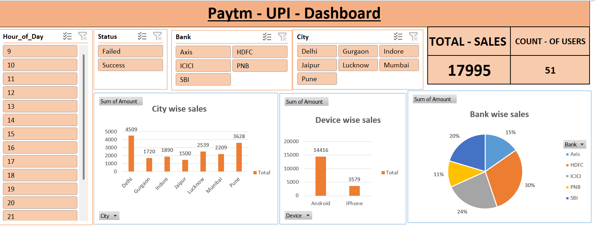

# 💳 Paytm UPI Transaction Dashboard – Excel

## 📊 Project Overview

This project is an **interactive Paytm UPI Transaction Dashboard** created using **Microsoft Excel**. The dashboard provides a clear overview of UPI transaction performance based on **sales amount, users, city, bank, device, status, and hour of day**.

The main objective of this project is to transform raw UPI transaction data into an interactive and easy-to-understand dashboard for analyzing transaction trends and performance.

---

## 🎯 Objectives

* Analyze total UPI transaction sales.
* Understand the number of users.
* Compare sales across different cities.
* Analyze bank-wise sales contribution.
* Compare transactions by device type.
* Analyze successful and failed transactions.
* Understand transaction activity by hour of the day.
* Create an interactive dashboard using Excel.

---

## 🛠️ Tools & Technologies

* **Microsoft Excel**
* Pivot Tables
* Pivot Charts
* Slicers
* Excel Formulas
* Data Analysis
* Data Visualization

---

## 📌 Dashboard Features

### 🔹 KPI Cards

The dashboard includes:

* **Total Sales:** 17,995
* **Count of Users:** 51

### 🔹 Interactive Filters

Users can filter the dashboard using:

* **Hour of Day**
* **Transaction Status**
* **Bank**
* **City**

### 🔹 Visualizations

The dashboard contains:

1. **City-wise Sales**

   * Compares total sales across different cities.

2. **Device-wise Sales**

   * Compares sales between Android and iPhone users.

3. **Bank-wise Sales**

   * Shows the contribution of different banks using a pie chart.

4. **Transaction Status**

   * Allows analysis of successful and failed transactions.

5. **Hour-wise Analysis**

   * Helps identify transaction activity during different hours of the day.

---

## 📈 Key Dashboard Insights

* **Delhi** has the highest city-wise sales among the displayed cities.
* **Android** contributes significantly more sales than iPhone.
* **HDFC** has the highest share in bank-wise sales.
* The dashboard allows users to quickly compare **Success vs Failed** transactions.
* Hour-wise filtering can be used to identify periods of higher transaction activity.

---

## 📷 Dashboard Preview



---

## 💡 Skills Demonstrated

* Data Cleaning & Preparation
* Data Analysis
* Excel Dashboard Development
* Pivot Tables
* Pivot Charts
* Data Visualization
* Interactive Slicers
* KPI Development
* Business Insight Generation

---

## 📂 Project Structure

```text
Paytm-UPI-Excel-Dashboard/
│
├── Paytm UPI Dashboard.xlsx
├── Paytm.png
└── README.md
```

---

## 🚀 Conclusion

This project demonstrates how **Microsoft Excel** can be used to convert transaction data into an interactive business dashboard. The dashboard makes it easier to monitor sales, users, banks, cities, devices, transaction status, and hourly transaction patterns.

This project is part of my **Data Analytics portfolio** and demonstrates my practical skills in **Excel, data analysis, and dashboard creation**.
